## Overview

The **DSG-22.6 GHz** is a high-performance, portable RF signal generator.  
It tunes continuously from **300 MHz up to 22.6 GHz with 1 Hz resolution**.  

Designed to be compact and cost-effective, it can be powered via USB and operated either in the lab or in the field.  

The generator offers outstanding spectral performance:  
- Harmonic suppression up to **40 dBc at 0 dBm output**  
- Output power adjustable from **+15 dBm down to -50 dBm** in **1 dB steps**  
- Fast frequency tuning in **100 µs**  
- Built-in diagnostics for temperature, voltage/current monitoring, and PLL lock status  

## Features & Technical Specs

| Parameter         | Value / Description |
|-------------------|----------------------|
| Frequency Range   | 0.15 GHz – 22.6 GHz |
| Frequency Resolution | 1 Hz |
| Output Power      | +20 dBm to -15 dBm, 1 dB steps |
| Sweep Mode        | Linear and logarithmic frequency sweep with adjustable start/stop, step size, and dwell time |
| Harmonic Suppression | ≤ 40 dBc (at 0 dBm output) |
| Reference Input   | 10 MHz external, SMA |
| Tuning Speed      | < 100 µs |
| Control Interfaces | touchscreen,USB Type-C,Wi-Fi |
|Built-in diagnostics | Temperature, voltage, current monitor and PLL lock status|
| Power Supply      | USB Type-C, 5 V / 1.5 A |
|Size                | 114 × 60 × 28.2 mm (5.67 × 2.36 × 1.11 in)|
|Weight             | 250 g (8.8 oz)|
|Open source         | Fully open hardware, firmware, and 3D models|

## Output Power
| Output Type | Freq Range | Output Power |
| :--- | :--- | :--- |
| **Filtered Output** | 2 - 18 GHz | 2 - 16 GHz Max 10 to 15 dBm |
| | | 16 - 18 GHz Max 7 to 10 dBm |
| **Unfiltered Output** | 0.15 - 22.6 GHz | 0.15 - 20 GHz Max 17 to 20 dBm |
| | | 20 - 22.6 GHz Max 14 to 18 dBm |

## Hardware & Power Requirements

- Powered by **USB-C** (can run from a laptop, charger, or even a power bank).  
- Standard **SMA RF connector** for output and reference input.  
- Compact, portable enclosure suitable for lab benches or field use.  

## Interfaces & Control

- Capacitive touch display for direct device control 
- **USB control** with SCPI-like command set  
- **Wi-Fi web interface** for browser-based control in the field  

## Touch display Usage

The device features an integrated touchscreen interface for controlling the DSG. Upon startup, the display defaults to the **Continuous Wave (CW)** tab.

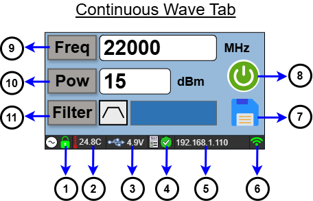

### CW Tab Controls & Indicators

* **1- PLL Lock Status**  
  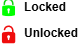  
  Indicates the Phase-Locked Loop (PLL) lock status.

* **2- PCB Temperature**  
  Displays the live temperature reading of the internal PCB.

* **3- USB Voltage**  
  Displays the input supply voltage provided via USB.

* **4- Built-in Test Result**  
    
  Displays the status and result of the internal Built-in Test (BIT).

* **5- IP Address**  
  Displays the active IP address (Hotspot/AP IP or Client/STA IP depending on the connection mode).

* **6- Wi-Fi Status / Icon**  
  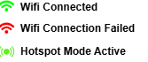  
  Indicates active Wi-Fi connection mode and status.

* **7- Save Button**  
    
  Saves the current output configurations to non-volatile memory.

* **8- RF On/Off Button**  
    
  Toggles the RF output signal ON or OFF.

* **9- Frequency Setting Menu Button**  
  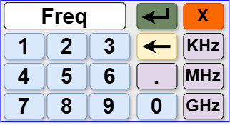  
  Enter the desired frequency value, select the unit (**KHz**, **MHz**, or **GHz**), and tap the green enter button (**↵**) to save.

* **10- Power Settings Menu Button**  
  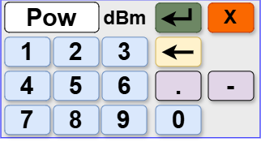  
  Enter the desired power value (in **dBm**) and tap the green enter button (**↵**) to confirm.

* **11- Filter On/Off**  
  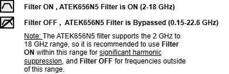  
  Toggles the internal RF filter ON or OFF.

---

### Navigating to the Sweep Tab

To switch from the **Continuous Wave (CW)** tab to the **Sweep** tab, swipe right on the touchscreen display.

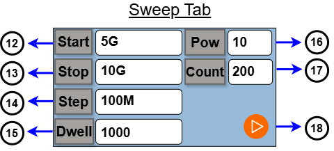

### Sweep Tab Controls

* **12- Frequency Start Button**  
  Sets the starting frequency for the sweep.

* **13- Frequency Stop Button**  
  Sets the stop frequency for the sweep.

* **14- Step Button**  
  Sets the frequency step interval for the sweep.

* **15- Dwell Time Button**  
  Sets the dwell time, which determines how long the signal stays at each frequency step during the sweep.

* **16- Power Button**  
  Sets the output power level (in **dBm**) for the sweep operation.

* **17- Count Button**  
  Sets the total number of sweep iterations. Enter `0` for continuous execution.

* **18- Sweep Start/Stop Button**  
  Starts or stops the frequency sweep sequence.

---

### Monitoring Menu Access

Tap the circular touch button on the right side of the display frame to switch to the Monitoring menu.

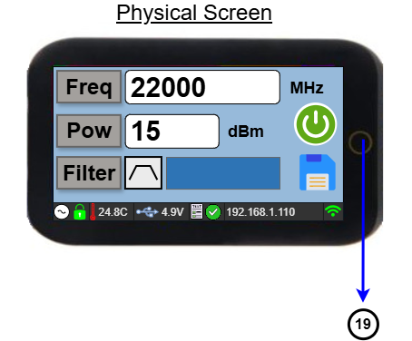

* **19- Monitoring Menu Button**  
  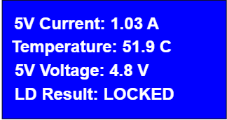  
  Opens the Monitoring menu to view live system diagnostics and telemetry readings.


## DSG Control UI (Desktop Application)

A Python-based desktop GUI (**"DSG 22.6 GHz - Professional Control Center"**) is provided to control the DSG signal generator over USB. It lets you generate a continuous-wave (CW) signal at a specific frequency and power, run frequency sweeps, load a device-specific calibration file, and monitor live telemetry (current, voltage, power, temperature, and PLL lock status).

### Requirements

- **Python 3.10 or newer** (developed and tested with Python 3.14.5; other 3.10+ versions are expected to work but have not been explicitly tested)
- A DSG device
- A **USB-C cable**

### Installation

1. Clone or download this repository.
2. Navigate to the UI source folder:
   ```bash
   cd UI
   ```
   *(adjust this path to match the actual folder name in this repo)*
3. (Recommended) Create and activate a virtual environment:
   ```bash
   python -m venv venv
   # Windows
   venv\Scripts\activate
   # macOS/Linux
   source venv/bin/activate
   ```
4. Install the required dependencies:
   ```bash
   pip install -r requirements.txt
   ```

### Required Libraries

| Library | Purpose |
|---|---|
| [`pyserial`](https://pypi.org/project/pyserial/) | Serial (USB) communication with the DSG device |
| [`PyQt6`](https://pypi.org/project/PyQt6/) | Graphical user interface framework |
| [`esptool`](https://pypi.org/project/esptool/) | Flashes ESP32-S3 firmware (.bin) directly from the UI's Firmware Update feature |


*(`sys`, `time`, `datetime`, and `json` are part of the Python standard library and require no separate installation.)*

### Connecting to the Device

1. Connect the DSG device to your PC using a **USB-C cable** — the **USB-C end plugs into the DSG**.
2. Run the main GUI script:
   ```bash
   python main_gui.py
   ```
3. In the top-left **Port** dropdown, click **REFRESH** to scan for available serial ports, then select the port corresponding to your DSG device.
4. Click **CONNECT**. Once connected, the UI and the DSG device are linked and ready for the next step.

---

### CW (Continuous Wave) Tab

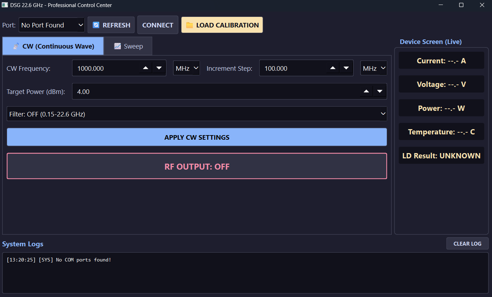

The **CW** tab is the default tab shown on startup. It configures the DSG to output a continuous signal at a single, fixed frequency and power level.

| Control | Description |
|---|---|
| **CW Frequency** | The output frequency. Enter the numeric value in the field, then select the unit (**kHz**, **MHz**, or **GHz**) from the dropdown next to it. |
| **Increment Step** | The step size used when incrementing/decrementing the CW Frequency value with the field's up/down arrows. |
| **Target Power (dBm)** | The desired output power level, in dBm. |
| **Filter** | Toggles the internal filter **ON** or **OFF** (see below for the effect of this setting). |
| **APPLY CW SETTINGS** | Sends the configured frequency, power, and filter settings from the UI to the device. The applied settings are also reflected on the DSG's own on-device screen. |
| **RF OUTPUT: OFF / ON** | Toggles the RF output. Click once to switch it to **RF OUTPUT: ON** and start generating the signal; click again to turn it back off. |

**Filter behavior:**
- **Filter: OFF** — allows output across the full **0.15–22.6 GHz** range. However, when the filter is off, the output signal contains visible **harmonics** alongside the fundamental (main) signal.
  <!-- Optional: insert a spectrum screenshot showing the fundamental signal with visible harmonics when Filter is OFF -->
- **Filter: ON** — restricts the usable range to **2–18 GHz**, but suppresses the harmonics by roughly **40 dB**, leaving a clean output with only the fundamental signal present.
  <!-- Optional: insert a spectrum screenshot showing the clean fundamental signal (harmonics suppressed) when Filter is ON -->

**Typical CW workflow:**
1. Enter the desired **CW Frequency** and unit.
2. Set the **Target Power (dBm)**.
3. Choose the **Filter** mode based on your required frequency range and harmonic suppression needs.
4. Click **APPLY CW SETTINGS** to push the configuration to the device.
5. Click **RF OUTPUT: OFF** to turn it **ON** and start generating the signal.

---

### Sweep Tab

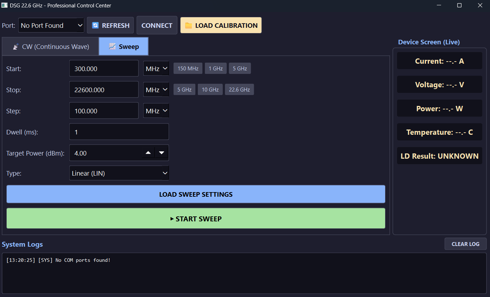

The **Sweep** tab configures the DSG to automatically scan across a range of frequencies, from a start frequency to a stop frequency, in defined steps.

| Control | Description |
|---|---|
| **Start** | The frequency at which the sweep begins. Enter the value and select its unit (kHz/MHz/GHz). Quick-select buttons (**150 MHz**, **1 GHz**, **5 GHz**) are provided for common start values. |
| **Stop** | The frequency at which the sweep ends. Quick-select buttons (**5 GHz**, **10 GHz**, **22.6 GHz**) are provided for common stop values. |
| **Step** | The frequency increment used to move from **Start** to **Stop** — i.e. how large each jump is between one sweep point and the next. |
| **Dwell (ms)** | The amount of time, in milliseconds, that the device holds/transmits at each individual frequency step before moving to the next one. |
| **Target Power (dBm)** | The output power level (in dBm) used throughout the sweep. |
| **Type** | The frequency progression mode for the sweep: **Linear (LIN)** or **Logarithmic**. |
| **LOAD SWEEP SETTINGS** | Sends the configured sweep parameters (Start, Stop, Step, Dwell, Power, Type) from the UI to the device. |
| **START SWEEP** | Begins the sweep using the most recently loaded settings. |

**Typical Sweep workflow:**
1. Enter the **Start** frequency and unit (or use a quick-select button).
2. Enter the **Stop** frequency and unit (or use a quick-select button).
3. Set the **Step** size — the frequency increment between sweep points.
4. Set the **Dwell (ms)** — how long the device stays on each frequency point.
5. Set the **Target Power (dBm)**.
6. Choose the **Type** (Linear or Logarithmic).
7. Click **LOAD SWEEP SETTINGS** to push the configuration to the device.
8. Click **START SWEEP** to begin scanning across the configured frequency range.

---
## Settings Tab

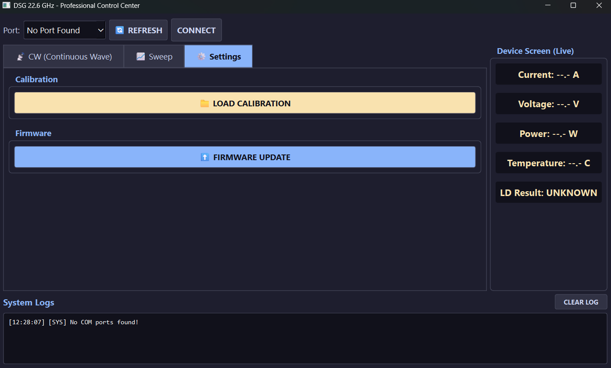

The Settings tab includes 'Load Calibration' and 'Firmware Update' buttons.   

The "Load Calibration" button is used to load a frequency-based calibration file.

### Firmware Update (from the UI)

The **Settings** tab includes a **FIRMWARE UPDATE** button that flashes a `.bin` file to the DSG directly from the UI, using `esptool` — no Arduino IDE required.
 
**Preparing the `.bin` file:**
 
Arduino IDE's "Export Compiled Binary" produces three separate files (bootloader, partition table, application). These must be merged into a single flashable image before using the UI's Firmware Update feature.
 
Run the following command in the folder containing the three exported files:
 
```bash
python -m esptool --chip esp32s3 merge_bin -o merged-firmware.bin --flash-mode keep --flash-freq keep --flash-size keep 0x0 <your-sketch-name>.ino.bootloader.bin 0x8000 <your-sketch-name>.ino.partitions.bin 0x10000 <your-sketch-name>.ino.bin
```
 
> ⚠️ **Important:** Always use `--flash-mode keep --flash-freq keep --flash-size keep` (not explicit values like `qio`/`80m`/`4MB`). Overriding these values manually was found to corrupt the merged image in a way that flashes "successfully" but leaves the device screen blank / device non-functional on boot. Using `keep` preserves the original settings already embedded in the exported files by Arduino IDE, which resolves this.
 
**Flashing:**
 
1. Connect the DSG via USB-C and select its port in the **Port** dropdown.
2. Go to the **Settings** tab and click **FIRMWARE UPDATE**.
3. Select the merged `.bin` file (e.g. `merged-firmware.bin`).
4. Confirm the prompt. Progress is streamed to the System Logs panel.

---

### Device Screen (Live)

Located in the top-right panel, this section displays real-time telemetry read back from the connected DSG device:

- **Current** (A)
- **Voltage** (V)
- **Power** (W)
- **Temperature** (°C)
- **LD Result** — PLL lock detect status (e.g. `UNKNOWN`, `LOCKED`, `UNLOCKED`), indicating whether the internal PLL is successfully locked to the requested frequency.

These values update live while the device is connected, and read `--.-` / `UNKNOWN` when no device is connected.

### System Logs

Located at the bottom of the window, the **System Logs** panel displays timestamped status and diagnostic messages from the application and the device — for example, port/connection status, applied settings confirmations, and device warnings or errors. Use the **CLEAR LOG** button to clear the log view.

---

## Firmware

The DSG firmware is written for the ESP32-S3 using the Arduino IDE.

### 1. Install the Arduino IDE

Download and install the [Arduino IDE](https://www.arduino.cc/en/software) (developed and tested with **version 2.3.10**).

### 2. Install the Required Boards

Open **Tools → Board → Boards Manager**, and install the following board packages:

| Board Package | Version | Description |
|---|---|---|
| Arduino AVR Boards *(by Arduino)* | 1.8.8 | Includes boards such as Arduino UNO, Arduino Duemilanove/Diecimila, and Arduino Mega ADK. |
| Arduino ESP32 Boards *(by Arduino)* | 2.0.18 | Includes the Arduino Nano ESP32 board. |
| esp32 *(by Espressif Systems)* | 2.0.17 | Includes ESP32 boards such as the ESP32 Wrover Module, IntoRobot Fig, Adafruit QT Py ESP32, and BPI-Leaf-S3 — this package provides the **ESP32S3 Dev Module** board used by the DSG. |

### 3. Install the Required Libraries

Open **Tools → Manage Libraries…**, and install the following libraries:

| Library | Author | Version | Description |
|---|---|---|---|
| CST816S | fbiego | 1.3.0 | Capacitive touch screen library — an Arduino library for the CST816S capacitive touch screen IC. |
| CST816_TouchLib | MDO | 2.2 | A CST816 touch and gesture library, tested using the LilyGO T-Display ESP32-S3 and T-Display S3 AMOLED boards. |
| TFT_eSPI | Bodmer | 2.5.43 | TFT graphics library for Arduino processors, with performance optimisation for RP2040, STM32, and other platforms. |

### 4. Configure the Board Settings

Open **Tools** in the Arduino IDE menu and set the following options:

| Setting | Value |
|---|---|
| Board | ESP32S3 Dev Module |
| USB CDC On Boot | Enabled |
| CPU Frequency | 240MHz (WiFi) |
| Core Debug Level | None |
| USB DFU On Boot | Disabled |
| Erase All Flash Before Sketch Upload | Disabled |
| Events Run On | Core 1 |
| Flash Mode | QIO 80MHz |
| Flash Size | 4MB (32Mb) |
| JTAG Adapter | Disabled |
| Arduino Runs On | Core 1 |
| USB Firmware MSC On Boot | Disabled |
| Partition Scheme | Huge APP (3MB No OTA/1MB SPIFFS) |
| PSRAM | Disabled |
| Upload Mode | UART0 / Hardware CDC |
| Upload Speed | 921600 |
| Port | *(select the COM port your DSG is connected to — see step 6)* |

### 5. Configure the TFT_eSPI Library

The `TFT_eSPI` library must be manually configured for this board's display before compiling.

Navigate to:

```
Documents/Arduino/libraries/TFT_eSPI/User_Setup_Select.h
```

Open `User_Setup_Select.h` with your code editor of choice, and make sure the LilyGo T-Display S3 configuration is enabled:

```cpp
#include <User_Setups/Setup206_LilyGo_T_Display_S3.h>
```

Make sure the default setup is disabled:

```cpp
//#include <User_Setup.h>
```

Only the setup required by the T-Display S3 should be enabled — other display setup files should remain commented out.

Once this is configured, the project is ready to be compiled from the Arduino IDE.

### 6. Upload the Firmware

1. Connect the DSG device to your PC using a **USB-C cable**.
2. In **Tools → Port**, select the COM port that appears for the connected device.
3. In **Tools → Board**, make sure **ESP32S3 Dev Module** is selected.
4. Double-check all the settings from steps 4–5 are correct.
5. Click **Upload**.

The firmware will now be uploaded to the DSG device.


### Quick Start Summary

1. Install the required libraries: `pip install -r requirements.txt`
2. Connect the DSG to your PC via USB-C (USB-C end into the DSG).
3. Run `python main_gui.py`.
4. In the **Port** dropdown, click **REFRESH**, select the correct port, then click **CONNECT**.
5. Click **LOAD CALIBRATION** and select the calibration file specific to your DSG unit.
6. Use the **CW** tab for a fixed-frequency signal, or the **Sweep** tab to scan across a frequency range.
7. Monitor live device telemetry in the **Device Screen (Live)** panel and diagnostic messages in **System Logs**.


## Demonstration Video

<p align="center">
  <a href="https://www.youtube.com/watch?v=-3eZY5avI0c" target="_blank" rel="noopener">
    
    <br>▶ Watch the Video
  </a>
</p>


## Live on Crowd Supply
If you’d like to support the project, it’s now live on Crowd Supply: https://www.crowdsupply.com/atek-midas/dsg-22-6-ghz

## License

This project is licensed under the MIT License.

You are free to use, modify, distribute, and use this project
for personal or commercial purposes, subject to the terms of
the MIT License.

Third-party libraries and components used by this project may
be distributed under their respective licenses.

